# Mermaid Diagram - Reservasi Futsal

## 1. UML Class Diagram
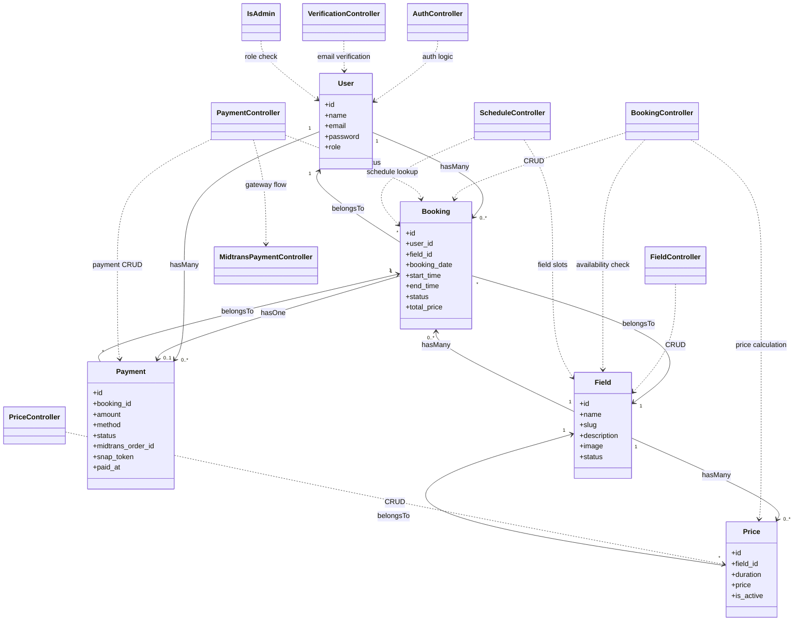

## 2. Sequence Diagram - Auth Flow
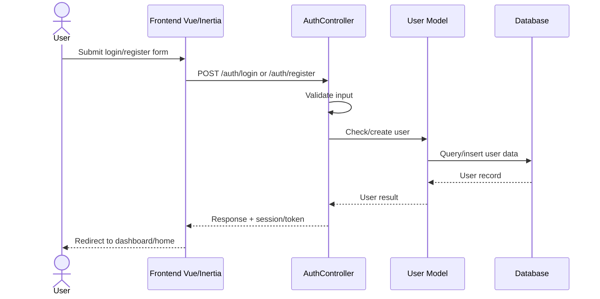

## 3. Sequence Diagram - Browse Lapangan
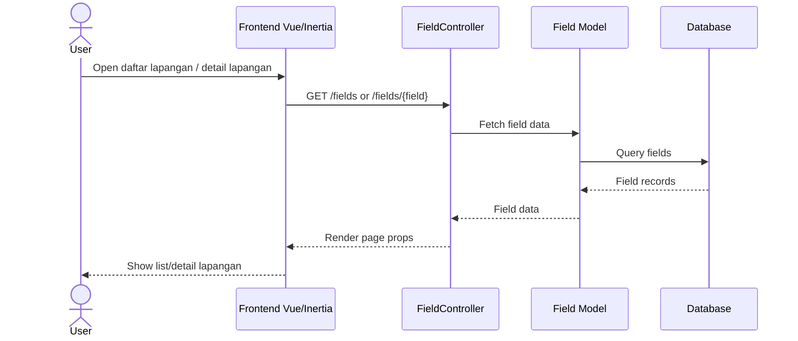

## 4. Sequence Diagram - Cek Jadwal
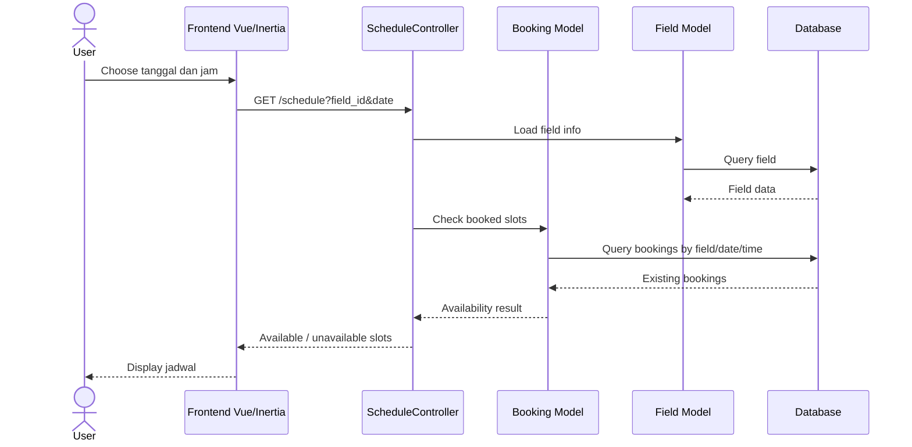

## 5. Sequence Diagram - Buat Booking
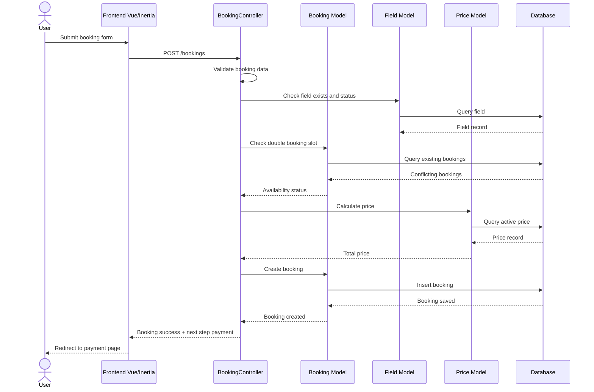

## 6. Sequence Diagram - Pembayaran Midtrans
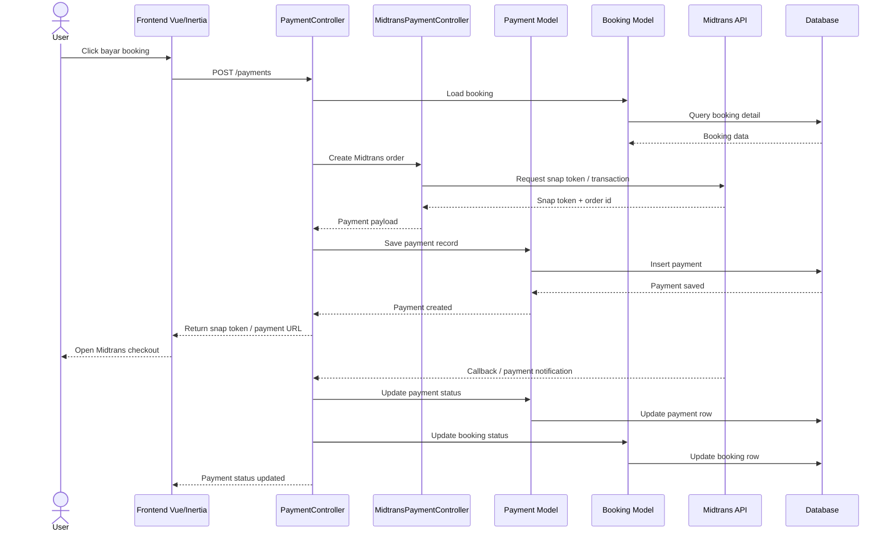

## 7. Sequence Diagram - Batalkan Booking
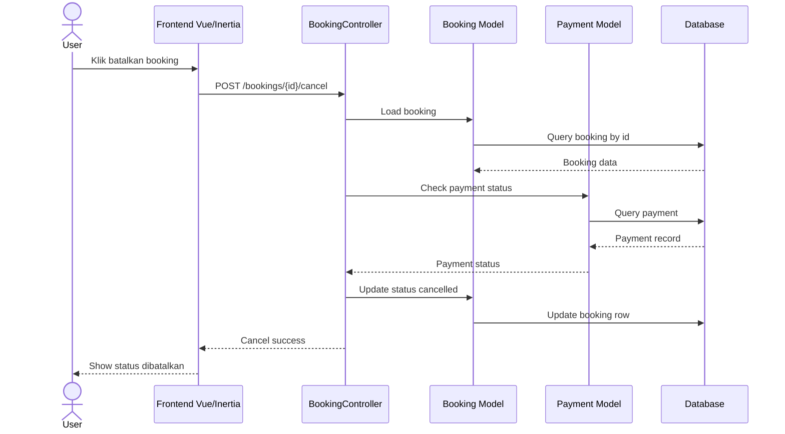

## 8. Sequence Diagram - Admin Kelola Lapangan
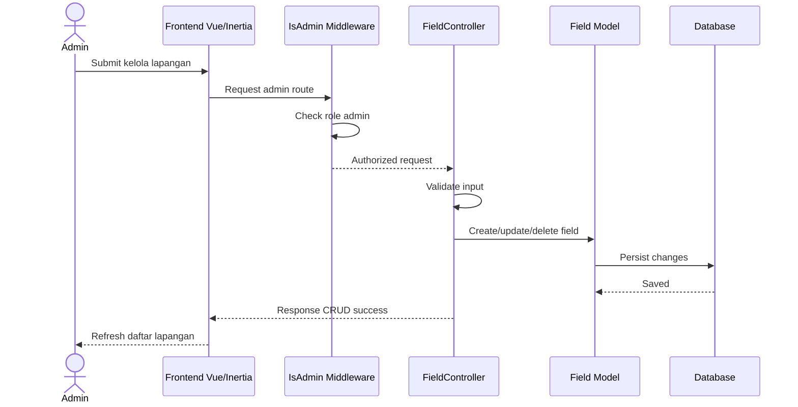

## 9. Sequence Diagram - Admin Kelola Harga
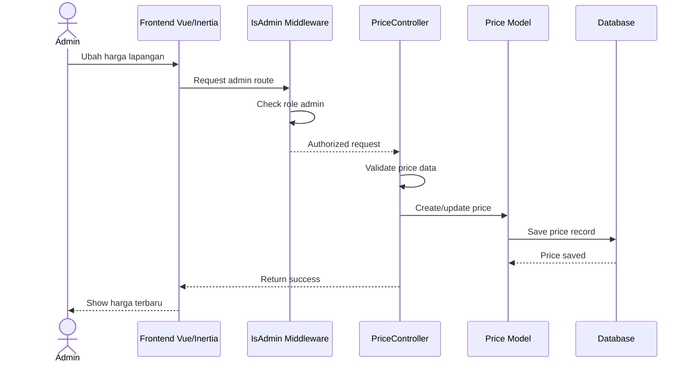

## 10. Sequence Diagram - Update Profil User
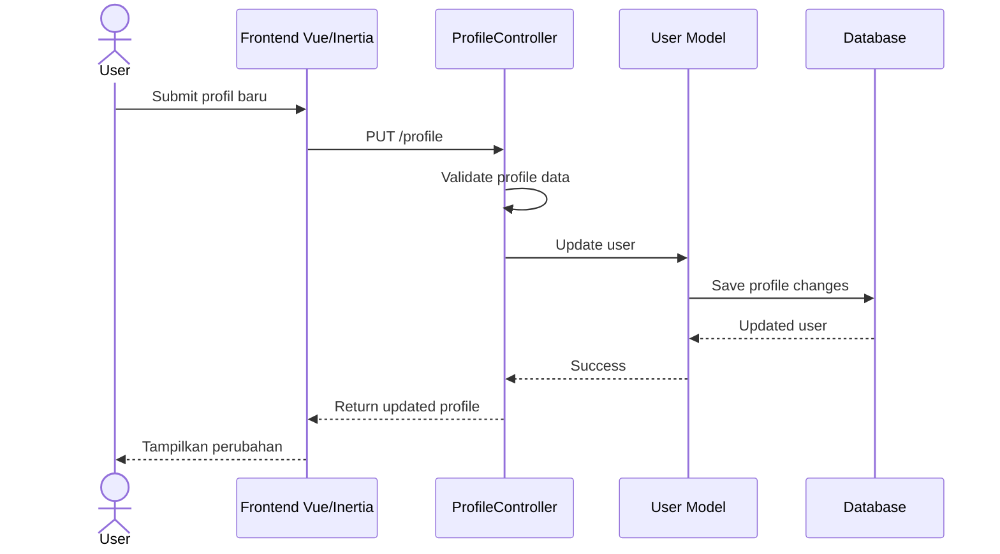

## 11. Sequence Diagram - Verifikasi Email / Reset Password
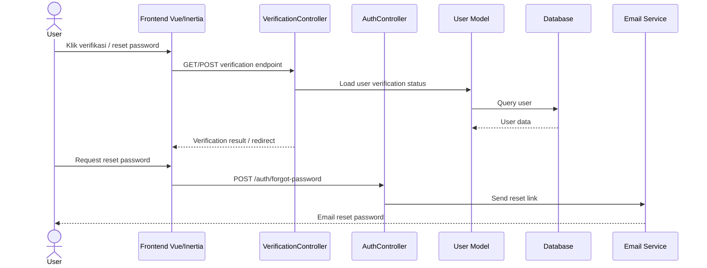

## 12. Component Diagram
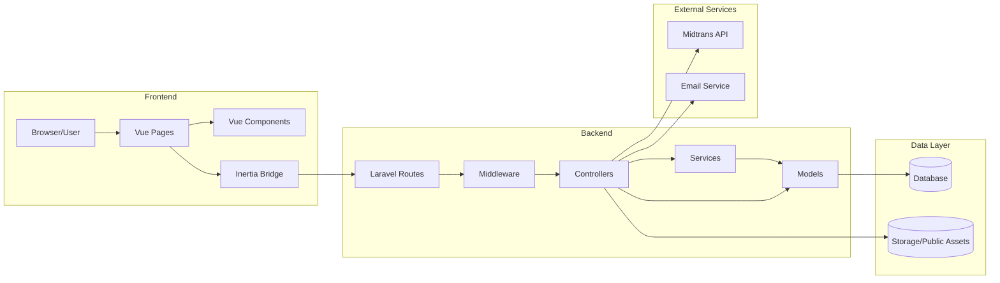

## 13. Arsitektur Diagram
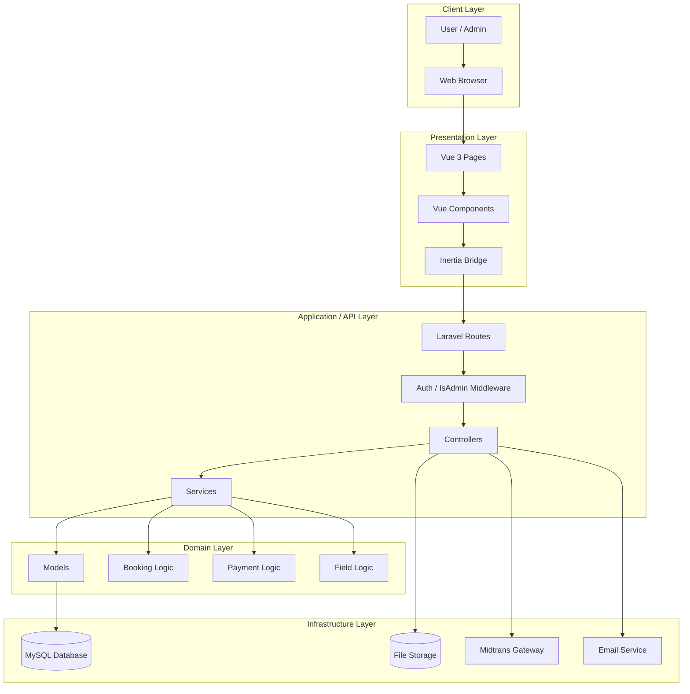

## 14. Arsitektur Sistem
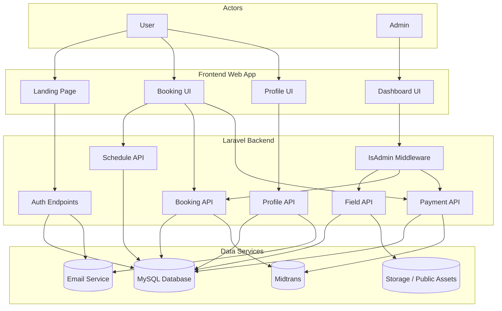
